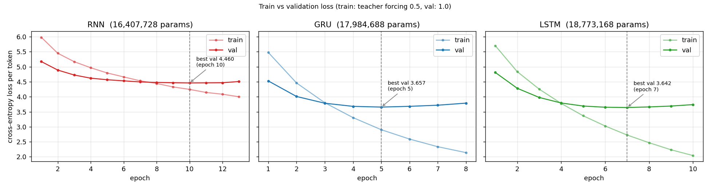
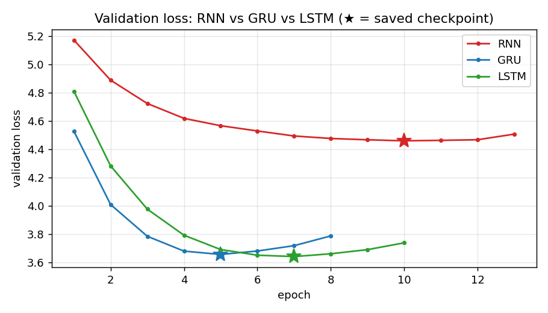
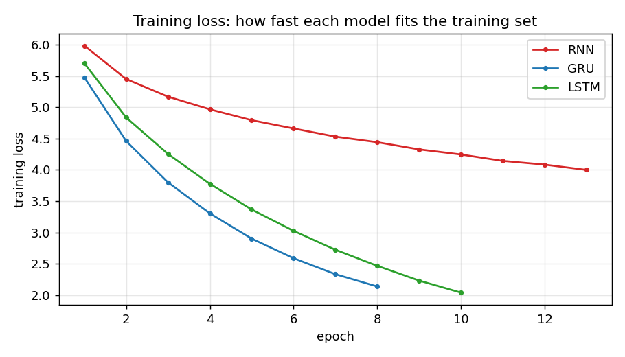
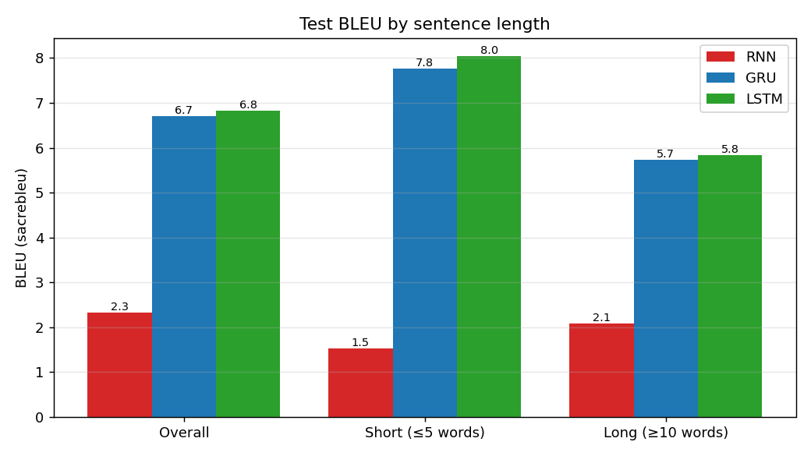
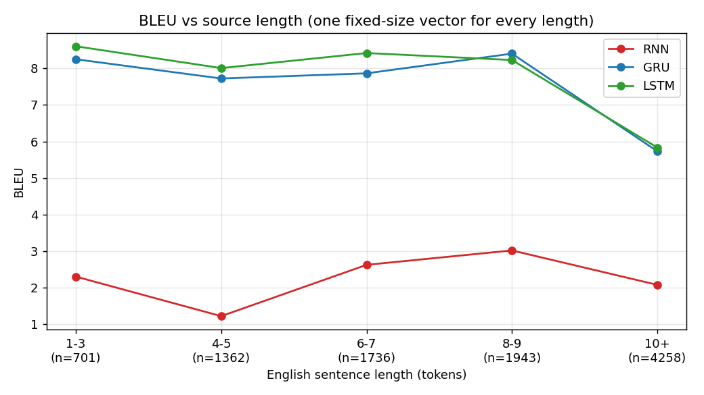
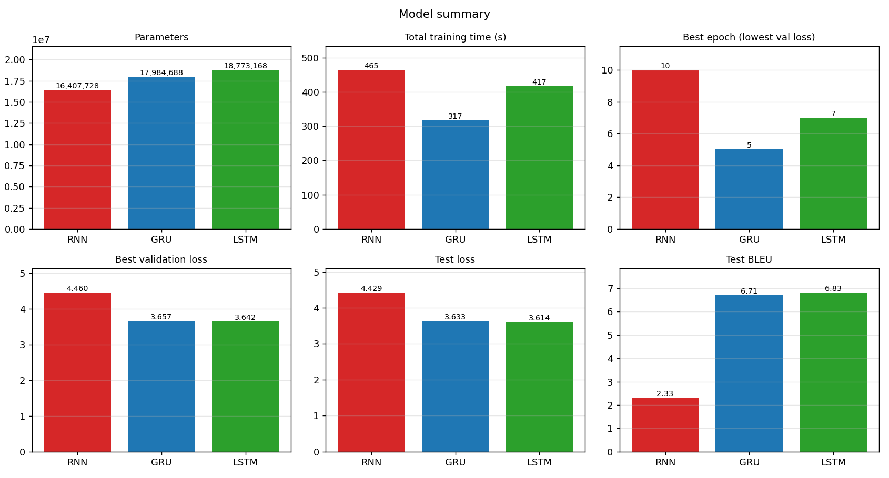
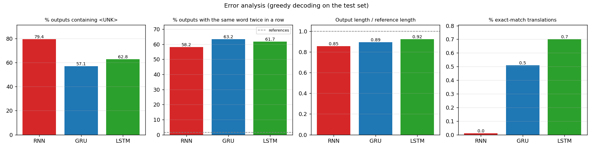

# Results: English → Hindi Seq2Seq (RNN vs GRU vs LSTM)

Basic Encoder–Decoder without attention, trained on a filtered subset of the IIT Bombay English–Hindi corpus (pairs with 3-15 tokens per side, 100k pairs, 80/10/10 split, seed 42). Same data, vocabulary, hyperparameters and seed for all three models; only the recurrent cell changes.
Test set: 10000 sentence pairs. Decoding: greedy. BLEU: sacrebleu corpus BLEU on our word-level tokenization, single reference.

## Metrics

| Metric | RNN | GRU | LSTM |
|---|---|---|---|
| Parameters | 16,407,728 | 17,984,688 | 18,773,168 |
| Total training time (s) | 465 | 317 | 417 |
| Best epoch (lowest val loss) | 10 | 5 | 7 |
| Train loss at best epoch | 4.246 | 2.902 | 2.725 |
| Best validation loss | 4.460 | 3.657 | 3.642 |
| Test loss | 4.429 | 3.633 | 3.614 |
| Test BLEU | 2.33 | 6.71 | 6.83 |
| BLEU short (≤5 words, n=2063) | 1.52 | 7.77 | 8.05 |
| BLEU long (≥10 words, n=4258) | 2.07 | 5.73 | 5.83 |
| % outputs with <UNK> | 79.4 | 57.1 | 62.8 |
| % outputs with a word repeated twice in a row | 58.2 | 63.2 | 61.7 |
|   (same statistic for the references) | 1.6 | 1.6 | 1.6 |
| Output / reference length | 0.85 | 0.89 | 0.92 |
| % exact-match translations | 0.0 | 0.5 | 0.7 |

## Loss curves

Note: training loss uses teacher forcing 0.5 and validation loss uses 1.0, so the two are not directly comparable. Overfitting shows as the validation loss rising while the training loss keeps falling.

## BLEU

## Model summary

## Error analysis

## Qualitative examples (first 15 test sentences)

**1. And our babies and children are dependent on us**

- REF: लेकिन हमारे बच्चे हम पर ही निर्भर रहते हैं
- RNN: और हमने <UNK> में <UNK> और <UNK> है ,
- GRU: और हमारे हमारे हमारे हमारे हमारे हमारे और और और
- LSTM: और हमारे हमारे बच्चे हमारे बच्चे हमारे बच्चे हैं

**2. Edit Server...**

- REF: सर्वर का संपादन करें . . ।
- RNN: फ़ाइल को . . ।
- GRU: सर्वर सर्वर . . ।
- LSTM: सर्वर संपादित करें . . ।

**3. Many things touched by Daar ji are there in that room.**

- REF: उस कमरे में दार जी के स्पर्श वाला बहुत कुछ है ।
- RNN: यह <UNK> <UNK> <UNK> के साथ <UNK> <UNK> <UNK> <UNK> ।
- GRU: कई <UNK> <UNK> कई कमरे में कई <UNK> हैं हैं ।
- LSTM: बहुत <UNK> <UNK> <UNK> हैं कि वहाँ से <UNK> आ जाते हैं ।

**4. His writings in prose are illuminated by citations from the Tamil poets.**

- REF: उनका समूचा गद्य साहित्य तमिष कवियों के उद्धकरणों से अलंकृत है ।
- RNN: <UNK> <UNK> के <UNK> <UNK> <UNK> <UNK> <UNK> <UNK> ।
- GRU: उनकी <UNK> <UNK> <UNK> <UNK> <UNK> <UNK> से <UNK> हैं ।
- LSTM: <UNK> के <UNK> से <UNK> से <UNK> के <UNK> द्वारा दी गई है ।

**5. Failed write file:% 1**

- REF: फ़ाइल लिखने में असफलः% 1
- RNN: फ़ाइल 1 . % 1 ( % s )
- GRU: फ़ाइल फ़ाइल में असफलः% 1
- LSTM: फ़ाइल 1 असफल

**6. Default answer value:**

- REF: डिफ़ॉल्ट जवाब मूल्यः
- RNN: वर्तमान में <UNK>
- GRU: उत्तर मूल्य <UNK>
- LSTM: डिफ़ॉल्ट मूल्य <UNK>

**7. Almast has written about these 'murtis' in great detail in his diaries.**

- REF: इन मूर्तियों का सविस्तार विवेचन उनकी डायरियों में हुआ है ।
- RNN: उन्होंने कहा कि भारत के <UNK> <UNK> <UNK> <UNK> <UNK> है ।
- GRU: <UNK> ने ने ने अपने <UNK> में <UNK> के बारे में <UNK> किया ।
- LSTM: इस ने ने अपने <UNK> में <UNK> में में <UNK> किया है ।

**8. Mailbox 10 (Face - Down)**

- REF: मेल-बक्सा 10 ( चेहरा-नीचे )
- RNN: मेल-बक्सा <UNK> ( चेहरा-नीचे )
- GRU: 10 10 10 ( 10 )
- LSTM: मेल-बक्सा 10 ( चेहरा-नीचे )

**9. and actually start decrypting it.**

- REF: और वास्तव में यह देक्र्यप्तिंग शुरू करते हैं ।
- RNN: और फिर से <UNK> ।
- GRU: और यह शुरू करने शुरू करते हैं ।
- LSTM: और वास्तव में <UNK> शुरू कर ।

**10. I have to borrow from this entire fifty.**

- REF: से बॉरो लेना होगा ।
- RNN: मैं इस <UNK> को <UNK> के लिए ।
- GRU: मैं इस से <UNK> का प्रयास कर ।
- LSTM: मुझे इस इस से से से ।

**11. Asserting false self importance.**

- REF: जिसके व्यवहार से घमंड प्रतिध्वनित होता हो ।
- RNN: <UNK> <UNK> <UNK> <UNK> है ।
- GRU: <UNK> <UNK> <UNK> महत्व है ।
- LSTM: <UNK> <UNK> <UNK> <UNK> को प्रभावित करते हैं ।

**12. Anansi soon heard how well Kweku Tsin 's crops were growing.**

- REF: अनासी ने सुना कि क्वेकू त्सिन की फसल किस तरह लहलहा रही है ।
- RNN: <UNK> <UNK> <UNK> <UNK> <UNK> और <UNK> <UNK> <UNK> ।
- GRU: <UNK> <UNK> की <UNK> <UNK> <UNK> <UNK> <UNK> <UNK> को <UNK> हो गया ।
- LSTM: <UNK> की <UNK> <UNK> की <UNK> की की की <UNK> की ।

**13. 5) Build peace in communities and the world at large.**

- REF: 5 ) बड़े पैमाने पर समुदायों और दुनिया में शांति का निर्माण करें ।
- RNN: <UNK> और सोमालिया में <UNK> और <UNK> <UNK> <UNK> हैं ।
- GRU: शांति और दुनिया में दुनिया और दुनिया से अधिक शांति से संपर्क ।
- LSTM: विश्व के विश्व में विश्व और विश्व धरोहर में ।

**14. Imagine their congratulations**

- REF: अब उस व्यक्ति की शुभकामनाएं
- RNN: यह भी देखें
- GRU: अपने अपने को को
- LSTM: अपने <UNK> की <UNK>

**15. It is proved that thallophyta are the most premitive plant life.**

- REF: यह सिद्ध किया जा चुका है कि थैलोफइटा सर्वाधिक प्राथमिक अवस्था होती है ।
- RNN: <UNK> <UNK> के <UNK> <UNK> <UNK> <UNK> <UNK> <UNK> हैं ।
- GRU: यह <UNK> जीवन <UNK> है <UNK> <UNK> है ।
- LSTM: यह <UNK> <UNK> है कि <UNK> सबसे <UNK> <UNK> है ।
